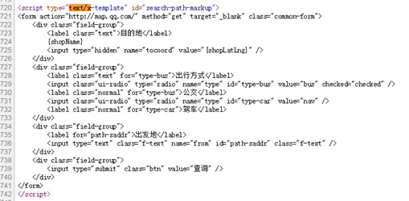

# BigRender

当一个网站越来越庞大，加载速度越来越慢的时候，开发者们不得不对其进行优化，谁愿意访问一个需要等待 10 秒，20 秒才能出现的网页呢？

常见的也是相对简单易行的一个优化方案是 [图片的延迟加载](http://www.cnblogs.com/zichi/p/5021697.html)。一个庞大的页面，有时我们并不会滚动去看下面的内容，这样就浪费了非首屏部分的渲染，而这些无用的渲染，不仅包括图片，还包括其他的 DOM 元素，甚至一些 js/css（某些js/css 是根据模块请求的，比如一些 ajax），理论上，每增加一个 DOM，都会增加渲染的时间。有没有办法能使得 HTML、js、css 都能按需加载呢？答案是肯定的，这就是本文要讲的 BigRender。

业界有很多 BigRender 在生产环境中的案例，比如 [新浪](http://www.sina.com.cn/)，[美团](http://sh.meituan.com/)，[途牛旅行网](http://www.tuniu.com/)，[360网址导航](https://hao.360.cn/)，[淘宝商品详情页](https://detail.tmall.com/item.htm?spm=a230r.1.0.0.zwD2MY&id=44115873692&ns=1) 等等。查看它们的源代码（ctrl+u），ctrl+f 搜索 textarea 关键字，很容易可以看到一些被 textarea 标签包裹的 HTML 代码。

比如途牛：

而这些被 textarea 标签包裹的 HTML 代码，只是 textarea 的 value 值，并没有渲染到 DOM 树上。没错，BigRender 通常就是用 textarea 标签包裹 HTML 代码（js/css），当作其 value 值，等到合适的时机（通常当 textarea 标签出现或者即将出现在用户视野时）将 textarea 中的 HTML 代码取出，用 innerHTML 动态插入到 DOM 树中，如有必要，取出 js/css 代码（正则），动态执行它们。（是不是和图片的延迟加载很相似？）

[玉伯指出](https://lifesinger.wordpress.com/2011/09/23/bigrender-for-taobao-item/)：

  页面下载完毕后，要经过 Tokenization — Tree Construction — Rendering. 要让首屏尽快出来，得给浏览器减轻渲染首屏的工作量。可以从两方面入手：
  
    1. 减少 DOM 节点数。节点数越少，意味着 Tokenization, Rendering 等操作耗费的时间越少。（对于典型的淘宝商品详情页，经测试发现，每增加一个 DOM 节点，会导致首屏渲染时间延迟约 0.5ms.）
  
    2. 减少脚本执行时间。脚本执行和 UI Update 共享一个 thread, 脚本耗的时间越少，UI Update 就能越发提前。

为什么是用 textarea 标签存放大块 HTML 内容？还是可以看下玉伯的 [这篇文章](https://lifesinger.wordpress.com/2011/09/23/bigrender-for-taobao-item/)。淘宝的 kissy 就内置了 [DataLazyload]() 组件。（插播：美团详情页还有用到 script 标签做 BigRender 优化，详情请见下面的 "其他" 一节)

接下去就来一步一步实现一个适合自己的 BigRender 插件，我希望可以延迟加载 HTML 元素、js 以及 css。

# T.datalazyload

仿照 jQuery 的写法我定义了一个全局对象 T，将延迟加载的实现代码封装在了 T.datalazyload 对象中，将需要延迟加载的代码 "包裹" 在 textarea 标签中，设置其 visibility 属性为 hidden，并赋予该标签一个特殊的类名（为了做事件监听），比如叫做 "datalazyload"。为了方便，**我规定每个做 bigrender 优化的 textarea 的父节点都只有一个子孩子（即该 textarea 元素）**，这一点非常重要必须遵守，因为后面代码有针对此的特殊处理。（注意要设置好父节点的高度宽度，和 dom 渲染后的高度宽度保持一致）

一些 HTML/js/css 代码都可以包裹在 textarea 标签中，例如：

  <textarea class="datalazyload" style="visibility: hidden;"> 
    
  
    
    

      <h1>我是延迟加载的部分！</h1>
    

  </textarea>

# init

给 T.datalazyload 对象定义一个 init() 方法，初始化页面时监听 scroll、resize 以及移动端的 touchmove 事件，当触发这些事件时，回调函数内判断延迟加载部分是否已经出现在视口。

    init: function(config) {
      var cls = config.cls;
      this.threshold = config.threshold ? config.threshold : 0;

      this.els = Array.prototype.slice.call(T.getElementsByClassName(cls));
      this.fn = this.pollTextareas.bind(this);

      this.fn();
      T.addEvent(window, "scroll", this.fn);
      T.addEvent(window, "resize", this.fn);
      T.addEvent(doc.body, "touchMove", this.fn);
    }

config 是配置参数，其 cls 属性表示需要延迟加载的 textarea 的类名，threshold 为阈值，单位 px，表示当 textarea 距离视口多少像素时，进行预加载。

将需要延迟加载的元素存入一个数组（this.els），（某 textarea 元素）后续一旦完成加载随即在数组中删除该元素。事件监听的回调函数为 pollTextarea() 方法。

# pollTextarea

    pollTextareas: function() {

      // 需延迟加载的元素已经全部加载完
      if (!this.els.length) {
        T.removeEvent(window, "scroll", this.fn);
        T.removeEvent(window, "resize", this.fn);
        T.removeEvent(doc.body, "touchMove", this.fn);
        return;
      }

      // 判断是否需要加载
      for (var i = this.els.length; i--; ) {
        var ele = this.els[i];

        if (!this.inView(ele)) 
          continue;

        this.insert(ele);
        this.els.splice(i, 1);
      }
    }

这个方法的作用是判断需要延迟加载的元素是否已经在视口，如果是，则进行加载（触发 insert 方法），并且在数组中删除该元素；如果数组为空，则表明需要延迟加载的部分都已经加载完，移除事件监听，整个延迟加载结束。

# insert

接下去看 insert 方法。inert 方法的参数是需要延迟加载的 textarea 元素，很显然，我们需要解析的代码全在 textarea.innerHTML 中。我们用 extractCode 方法取出其中的 js/css 代码，然后将 js/css 过滤掉，这样剩下的就全是 HTML 代码了，将其插入 DOM 中（这正是前文说的 "每个 textarea 的父节点都只有一个子孩子" 的原因，可以直接用父节点 innerHTML 操作），如果有 loading 效果，一般在父节点加个 loading 类，移除即可。最后再动态执行 js 脚本，插入 css 样式。

    insert: function(ele) {
      var parent = ele.parentNode
        , txt = this.decodeHTML(ele.innerHTML)
        , matchStyles = this.extractCode(txt, true)
        , matchScripts = this.extractCode(txt);

      parent.innerHTML = txt
        .replace(new RegExp("<script[^>]*>([\\S\\s]*?)</script\\s*>", "img"), "")
        .replace(new RegExp("<style[^>]*>([\\S\\s]*?)</style\\s*>", "img"), "");

      if (matchStyles.length) 
        for (var i = matchStyles.length; i --;) 
          this.evalStyles(matchStyles[i]);

      // 如果延迟部分需要做 loading 效果
      parent.className = parent.className.replace("loading", "");

      if (matchScripts.length) 
        for (var i = 0, len = matchScripts.length; i < len; i++) 
          this.evalScripts(matchScripts[i]);
    },

# extractCode

我们通过正则将 js 和 css 标签部分取出：

  extractCode: function(str, isStyle) {
    var cata = isStyle ? "style" : "script"
      , scriptFragment = "<" + cata + "[^>]*>([\\S\\s]*?)</" + cata + "\\s*>"
      , matchAll = new RegExp(scriptFragment, "img")
      , matchOne = new RegExp(scriptFragment, "im")
      , matchResults = str.match(matchAll) || [] 
      , ret = [];
  
    for (var i = 0, len = matchResults.length; i < len; i++) {
      var temp = (matchResults[i].match(matchOne) || [ "", "" ])[1];
      temp && ret.push(temp);
    }
    return ret;
  }

成功地将 script 以及 style 标签内的内容提取了出来，巧妙地用了正则中的子表达式。

# evalScripts/evalStyles

脚本执行，样式渲染。

  evalScripts: function(code) {
    var head = doc.getElementsByTagName("head")[0]
      , js = doc.createElement("script");
  
    js.text = code;
    head.insertBefore(js, head.firstChild);
    head.removeChild(js);
  },
  
  evalStyles: function(code) {
    var head = doc.getElementsByTagName("head")[0]
      , css = doc.createElement("style");
  
    css.type = "text/css";
    try {
      css.appendChild(doc.createTextNode(code));
    } catch (e) {
      css.styleSheet.cssText = code;
    }
    head.appendChild(css);
  }

# 优缺点 & 适用场景

简单讲讲 BigRender 优化的优缺点，以及适用场景。

优点很明显，因为减少了首屏 DOM 的渲染，所以能加快首屏加载的速度，并且能分块加载 js/css，非常适用于一些模块区分度很高的网站（个人觉得大型网站的模块区分度普遍越来越高了）。

缺点是需要更改 DOM 结构（DOM 节点的替换和渲染），可能会引起一些重排和重绘。一些没有开启 js 功能的用户将看不到延迟加载的内容（可以用 noscript 标签给出一个善意提醒）。最大的缺点可能是不利于 SEO，一些依赖于 SEO 的网站可能需要在 SEO 上下点功夫了，比如美团。

关于 SEO，可以看下 <http://www.seoqx.com/lynx> 这个网站，能模拟搜索引擎蜘蛛对网站的爬取情况。美团对于 BigRender 以及 SEO 解决方案 [[美团网案例]改善BigRender技术导致的SEO问题](http://www.seoqx.com/services/case1.php)

bigrender 通过减少 DOM 节点，加快首屏的渲染，但是，它也是有额外的性能损耗的，渲染前textarea 里面的 html 代码，在服务端把 html 代码保存在隐藏的 textarea 里面，所以在服务端会把 html 代码转义：尖括号等都被转义了，这个会增加服务器的压力；而且，这个改造只是前端的渲染，**服务器依旧是一次计算所有的数据**，输出所有的数据，这一点没有得到提高。

一般来说，使用都是后端拼接成 html 字符串，然后塞入 textarea 标签中，吐给前端。

# demo

如果要做一个完整的 BigRender demo，可能比较复杂，还要涉及到后端。

之前学习 lazyload 时做过一个图片的延迟加载 demo，see <http://hanzichi.github.io/2015/picture-lazyload/>。因为 BigRender 是 lazyload 的加强版，所以简单地做了个 BigRender 版本的图片延迟加载 <http://hanzichi.github.io/2016/bigrender/>，实现的具体代码可以 check <https://github.com/hanzichi/hanzichi.github.io/tree/master/2016/bigrender>。求 star，求 fork~

# 其他

除了首页部分用了 textarea 做 BigRender 优化外，美团还用到了 script 标签做优化。比如 [这个商品详情页](http://sh.meituan.com/deal/30135283.html?mtt=1.index%2Ffloornew.md.110.iliphxfg)

给 script 标签设置个非 "text/javascript" 的 type，可以下载这段 js，但不执行，这种做法似曾相识，在 labjs 中看到过。

更多可以参考 [前端优化三续：用script存放html代码来减少DOM节点数](http://www.cnblogs.com/zhengyun_ustc/archive/2012/07/22/2603403.html)

# Read More

- [淘宝详情页的 BigRender 优化与存放大块 HTML 内容的最佳方式](https://lifesinger.wordpress.com/2011/09/23/bigrender-for-taobao-item/)（推荐！！如果被Q了可以 [看这里](http://www.oschina.net/question/55577_28553?fromerr=rZrbZlop)）
- [前端优化：BigRender的textarea延迟渲染和关于LABjs的实践](http://www.cnblogs.com/zhengyun_ustc/archive/2012/07/21/BigRender.html)
- [lazyload延迟加载组件](http://www.cnblogs.com/lecaf/archive/2011/04/08/lazyload.html)
- [KISSY懒加载data lazyload 的应用](http://highsea90.com/index.php/archives/1744)
- [kissy datalazyload.js 源码](https://code.google.com/p/kissy/source/browse/trunk/src/datalazyload/datalazyload.js)
- [kissy DataLazyload API](http://docs.kissyui.com/1.3/docs/html/api/component/datalazyload/)
- [kissy DataLazyload demos](http://docs.kissyui.com/1.3/docs/html/demo/component/datalazyload/index.html)