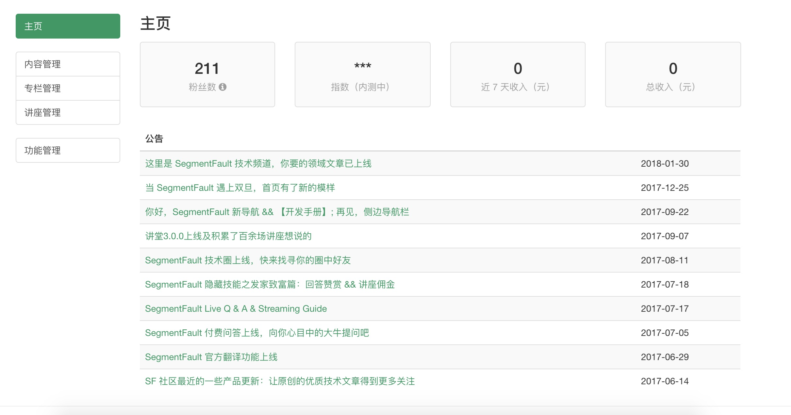

# 前言

前段时间，[SegmentFault](https://segmentfault.com/) 低调上线了 [技术号](https://segmentfault.com/mp) 模块，方便用户对数据进行集中管理。在开发过程中，第一次引入了 MV* 框架。



SF 的基本架构还是后端路由，这也使得页面频繁地整体请求，体验非常不好。而技术号这个模块，不依赖 SEO，侧边导航又具有非常强烈的可切换性，所以适当地引入一个 MV* 框架是非常合适的。基于此考虑，决定在这个模块的开发中引入 Vue.js。

SF 目前的前端架构是非常传统的，jQuery+BootStrap+Requirejs+Gulp 的开发组合，r.js 做上线前的打包。如何将 Vue.js 应用进入目前的架构？其实非常简单，遵循一个原则即可，r.js 最后打包成一个 js 文件，而 webpack 最后也是打包成一个 js 文件。

我们用 webpack-dev-server 起前端 server 后，在内存中生成的 js 的路径类似 localhost:8080/xxx.js，然后在后端模版中引用这个 js 即可。值得注意的是，必须写死绝对路径，所以只能指定端口，目前我还没有找到更好的办法解决这个问题。

# 图片引用

其他部分的开发，比如 js 和 css 都没有什么大的问题，图片的引用成了问题。在第一次上线时我用了线上的绝对路径，这显然是不合理的。

之前的图片引用，其实是依赖后端的。前端上线时，会有一个文件夹包含所有的 js、css 以及图片文件，然后将这个文件夹重命名（重命名成一个哈希版本号），再上传到 CDN。所以如果独立打开 js、css 或者图片文件，其实路径上是会有一个版本号的。

那么目前线上是如何解决的？目前应用图片的地方主要是后端模版文件以及 css。如果是后端模版文件，引用图片时会先调用一个后端函数，这个函数会返回图片路径，很显然开发环境和线上环境这个路径的结果是不同的。同样，js 和 css 的引入，都会被这个函数先调用才返回引用路径。而在 css 中引用图片就没啥问题了，只是个相对路径的事。

而将图片引用放入前端了呢？图片的路径和 js 的路径具有某种联系，本质是需要获取这个哈希版本号。问题在于，如何获取正在执行的 js 文件的路径？其实这很像是一道脑筋急转弯，如果习惯了 Node 的方式，可能会从 `__dirname` 和 `process.cwd()` 去入手，但是很遗憾虽然客户端也能引入 process 、path 等包，但是获取不到类似的值。答案也很简单，直接获取 script 的 dom 节点，然后取 src 即可，就是完美的绝对路径。另外还有个方法，可以用 `document.currentScript.getAttribute('src')`，但是 src 赋值的字符串是什么，它就是什么，而且在实际开发中莫名报错，所以我用了前者。

```js
cdn: src => {
  let jsPath = document.getElementById('indexScript').src.replace(/script.*/, 'img/') 
  src = jsPath + src
  return src
}
```
这样就粗暴地解决了线上图片引用的问题。

# 开发 VS 线上

但是本地开发引用图片的问题还没有解决。

综上所述，本地开发起的前端 server，其实是用了绝对地址 localhost:8080/xxx.js，如果用以上规则获取图片，很显然获取的还是 localhost:8080 域名下的图片，我们需要将其切换到后端路由的测试域名下。

也就是规则类似 localhost:8080/build/xxx/img/xxx.png 的请求都需要转到另外一个域名下（实际开发中是 sf.testapp.org），chrome 下有个神器 [ReRes](https://chrome.google.com/webstore/detail/reres/gieocpkbblidnocefjakldecahgeeica) 可以轻易做到。

配置如下：

```
// If URL match
http://localhost:8080/build/(.*)/img/
// Response
http://sf.testapp.org/build/$1/img/
```

这样就粗暴解决了开发环境引用不到图片的问题。

# 待续

这并不是终点。其实目前的图片是放在最终上线的静态文件文件夹中，和 Vue.js 整个开发项目剥离，这并不是一个好的方式。最好的方式肯定是放在 Vue.js 项目中，比如 assets 或者 static 文件夹下。这就需要在前端引用图片的时候判断是开发还是线上环境，分别引用不同地址，开发完后，打包前需要将项目中的图片同步到需要上线的静态文件文件夹中。还有另一种方案，开发和线上引用一个地址，但是开发环境引用时再做一次映射，跳到 Vue.js 项目内。

目前还没考虑这点，因为这只是 MV* 的第一次尝试，文件目录的结构还没最终确定。

# 思考

这个功能的开发其实不具有典型的参考意义，我称之为 "走 SF 特色的一次开发尝试"。毕竟需要前后端路由混杂，而且还和最终线上打包方式有关，只能因地制宜，走自己的路。

这让我想到了之前一位前辈对我说的话：

> 前端的主要竞争力还是学习能力，程序员的竞争力是解决问题的能力。

共勉之